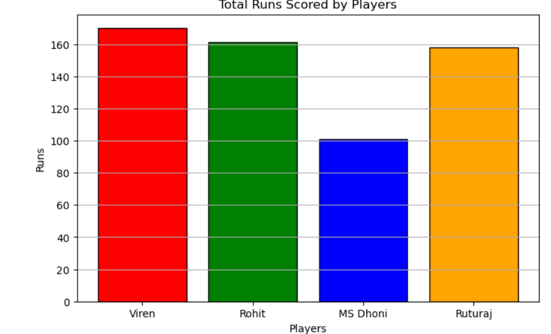
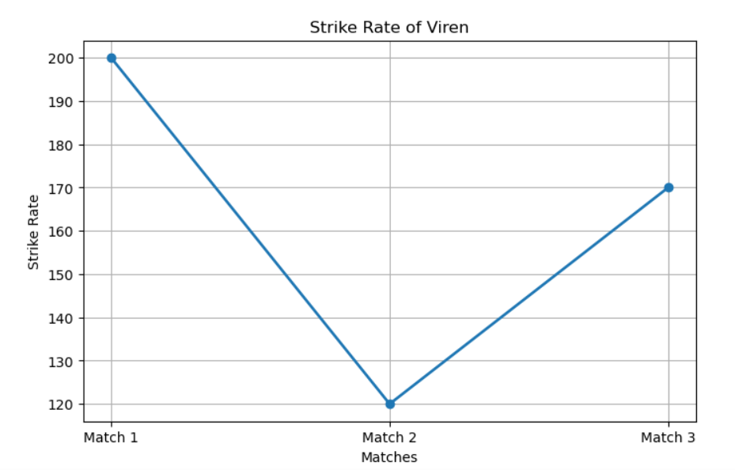

# Cricket_analyis.py
This project demonstrates how NumPy and Matplotlib can be used to analyze cricket player performance data. The dataset contains runs scored and balls faced by four players across three matches. Various statistical analyses are performed to evaluate player performance, and the results are visualized using different charts.

## 📊 Output Screenshots

### Bar Chart

### Pie Chart

### Strike Rate Line Chart

